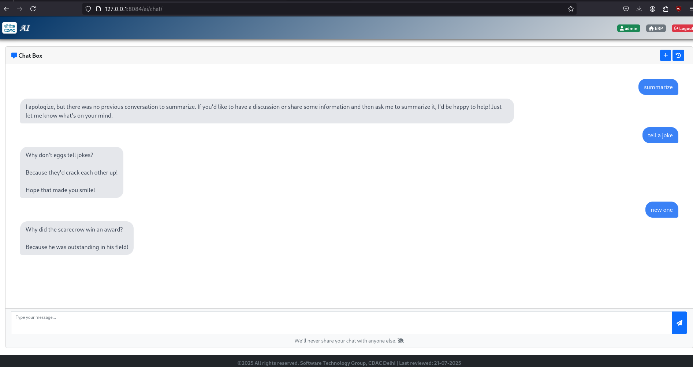
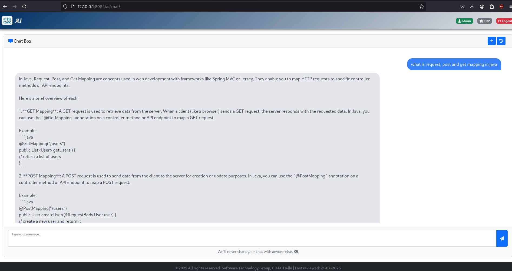

# SpringAI_Chatbot
A ChatGPT-styled Chatbot built using Java and Spring AI (code cannot be displayed due to proprietary nature)

- ### Chat Interface

The interface was designed keeping ChatGPT's interface in mind, so that users will immediately feel at home interacting with the chatbot.

- ### Records all Conversation History

This tab keeps a record of all the chat history which the user has initiated, so that he/she can go back to any of them, and reference / continue / delete any conversation.

- ### Reply Generation Process

With the block reply method, the backend AI takes a couple of seconds to generate the reply, during which it displays this "thinking..." message.

  
- ### Asking the AI to tell us a joke

- ### Asking the AI a technical question

## Technologies Used
* **Backend:** Java, Spring AI
* **Database:** PostgreSQL
* **AI Model:** Meta Llama 4.0 (Hosted by CDAC, New Delhi)
* **Frontend:** HTML, CSS, JavaScript, Bootstrap
* **Build Tool:** Maven
